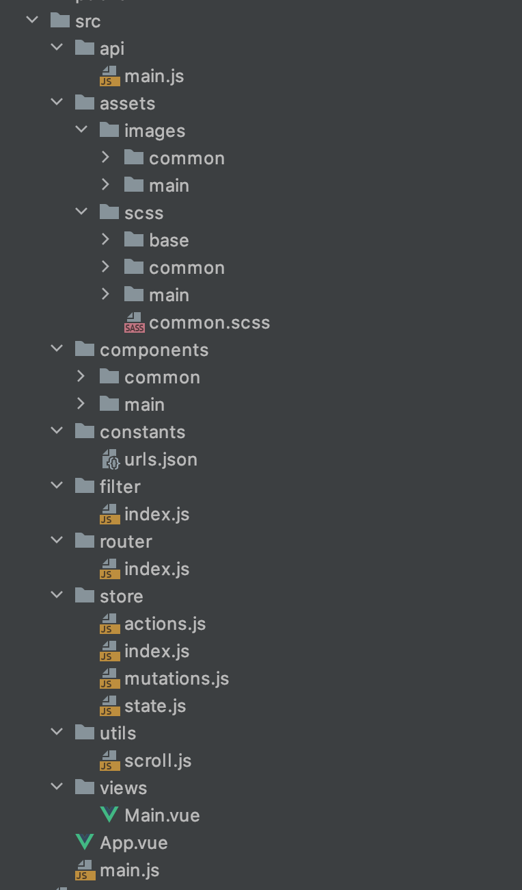
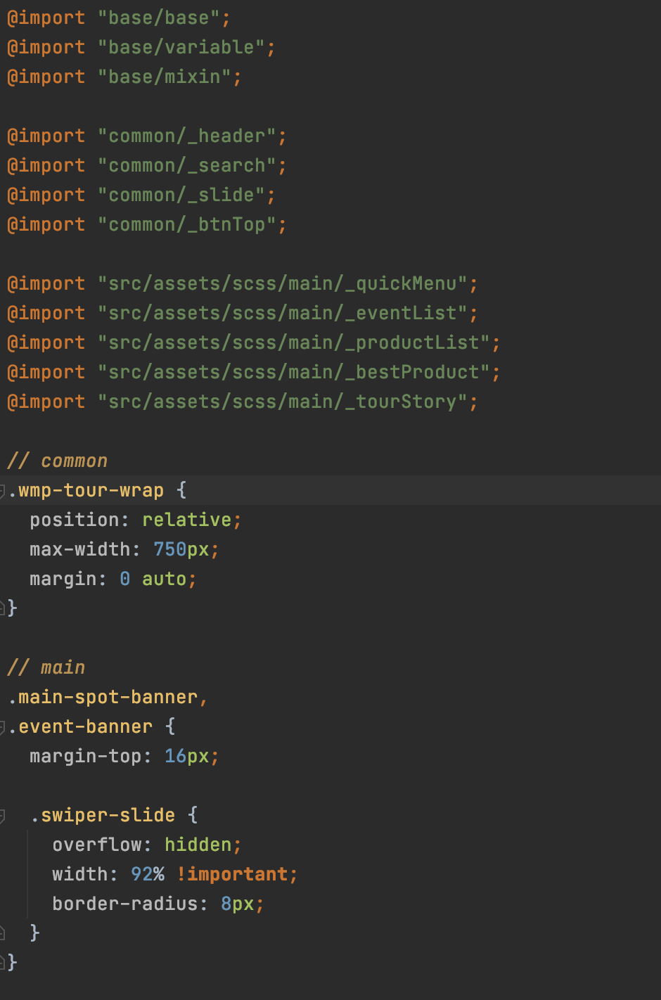
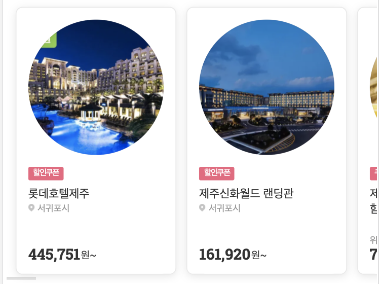
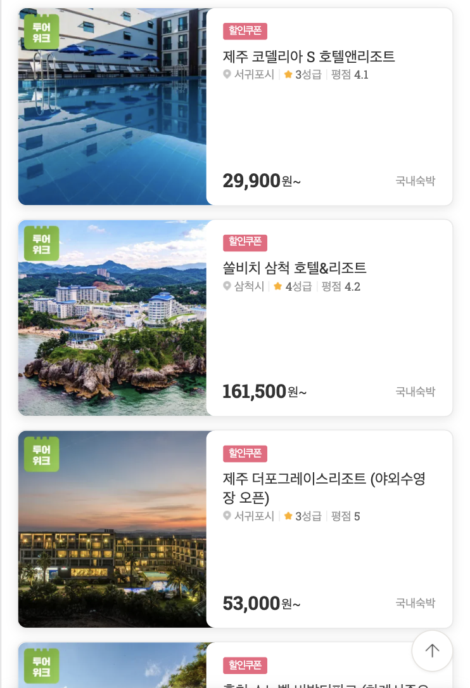
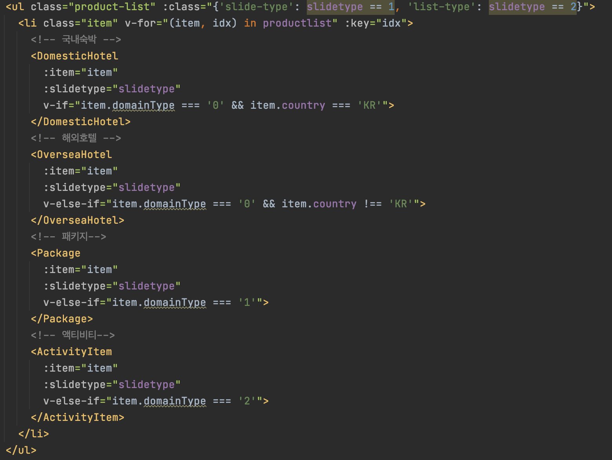

# 위메프 투어 메인 clone

개인적으로 진행해 본 위메프 투어 메인 clone 작업입니다.


## 화면


## 폴더구조



**api**/main.js - axios를 통해 서버데이터를 통신

**assets** - 이미지와 scss파일

**components**/common - 공통 컴포넌트 파일

**components**/main - 메인 컴포넌트 파일

**constants**/urls.json - url 모음

**filter**/index.js - 공통 필터

**router**/index.js - 라우터

**store** - 스토어

**utils**/scroll.js - 스크롤 공통 기능

**views** - 뷰


## Contatiner, Presenter

데이터 **처리**와 **출력**을 분리할 수 있는 **Contatiner, Presenter** 패턴으로 작업을 진행하였습니다.

view/main.vue - container
components/... - presenter

모든 데이터는 main.vue 에서 받아서 각각의 컴포넌트로 props를 통해 전달해주었습니다.


## api/main.js

공통 통신 함수를 만들어서 사용했습니다.

```js
const request = ({method, url, baseURL = URL.config.url , data, params}) => {
  return axios({
    method,
    baseURL,
    url,
    data,
    params
  }).then(result => result.data)
    .catch(result => {
      const { status } = result.response;
      console.log('error : ' + status)
    })
}

export const main = {
  tourStory() {
      return request(
        {
          method: 'get',
          url: '/api/v0/external/tour/preview',
          baseURL: URL.tourStory.url
        })
  }
}
```


## assets/scss

컴포넌트 스타일을 style scope로 선언했을때 동적으로 그려지는 dom에는 적용이 안되는 점과 유지보수의 용이를 생각하여 스타일은 컴포넌트에 선언하지 않고 scss파일로 관리 했습니다.

각각 컴포넌트에 scss파일을 따로 만들어 관리하기 용이하게 진행했습니다




## components

common - 공통으로 사용되는 컴포넌트 (배너, 헤더, 탑버튼, 검색 ...)

main - 메인에만 사용되는 컴포넌트


### Common/BannerSlide.vue

메인페이지에 들어가는 배너에 공통으로 사용되는 컴포넌트 입니다.


1. 이미지 케이스별 분기처리

  - 슬라이드 이미지 여러개 일 때
  - 슬라이드 이미지 여러개 + 이미지 링크 없는경우
  - 슬라이드 이미지 1개일 때
  - 슬라이드 이미지 1개 + 이미지 링크 없는 경우

   ```vue
   <swiper ref="mySwiper" :options="swiperOption" v-if="bannerList.length > 1">
      <swiper-slide v-for="(item, idx) in bannerList" :key="idx">
        <!-- 이미지 여러개 일 때 -->
        <a :href="item.linkUrl" v-if="item.linkUrl">
          
        </a>

        <!-- 이미지 여러개 + 링크없는 케이스 -->
        
      </swiper-slide>
      <div slot="pagination" class="swiper-pagination" :class="{'btn-banner': bannerPopup}"></div>
   </swiper>

   <!-- 이미지 1개 -->
   <a :href="bannerList[0].linkUrl" v-else-if="bannerList[0].linkUrl">
   
   </a>

   <!-- 이미지 1개 + 링크없는 케이스 -->
   
   ```

2. 배너전체보기팝업 prop로 컨트롤

   ```vue
   <BannerSlide
     :bannerList="isMainBanner"
     :bannerPopup="true"> //true면 배너전체보기팝업 노출
   </BannerSlide>
   ```

3. 각각의 슬라이드 옵션 props로 넘겨줘서 설정할 수 있도록 설계

   ```vue
   <BannerSlide
     :bannerList="isMainBanner"
     :option="mainSliderOption"> //prop로 설정할 option을 넘겨준다.
   </BannerSlide>
   ```

   BannerSlide.vue

   defaultOption 디폴트 슬라이드 옵션에 props로 넘겨준 options이 병합되서 적용된다.

   ```js
   data(){
     return{
       defaultOption: {
         loop: true,
         pagination: {
           el: '.swiper-pagination',
           type: 'bullets'
         }
       },
       isPopShow: false,
       winScrollTop: 0,
       loadedImgCount: 0
     } // 디폴트 옵션
   },
   computed: {
     swiperOption() {
       return Object.assign({}, this.defaultOption, this.option)
     } // 디폴트 옵션 + props로 넘겨준 옵션 병합
   }
   ```


### main/ProductList.vue

동일한 컴포넌트에 class로 type지정하여 스타일 제어


- default type

  ```vue
  <ProductList :productlist="productlist"></ProductList>
  <!-- default타입은 타입 지정 없어도 된다. -->
  ```


- slide-type

  ````vue
  <ProductList :productlist="productlist" :slidetype="1"></ProductList>
  <!-- slidetype="1" -->
  ````




- list-type

  ```vue
  <ProductList :productlist="productlist" :slidetype="2"></ProductList>
  <!-- slidetype="2" -->
  ```




국내숙박, 해외호텔, 액티비티, 패키지 데이터 구성이 달라서 각각 컴포넌트로 분리해서 적용
데이터 조건에 맞는 컴포넌트를 사용할 수있도록 설계했습니다.




